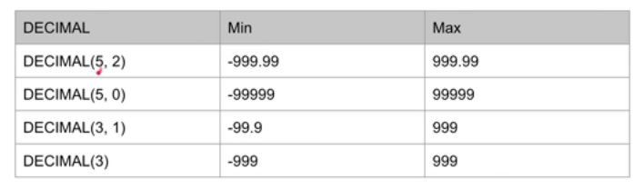

## Tipe Data

- [Tipe Data Number ](#tipe-data-number)
- [Tipe Data String ](#tipe-data-string)

### Tipe Data Number

Tipe data number terdapat beberapa jenis, yaitu:

#### 1. Tipe data Integer

Tipe data Integer merupakan tipe data number dengan bilangan bulat.

Jenis-jenis tipe data Integer

 

#### 2. Tipe data Floating Point

Tipe data Floating Point merupakan tipe data number dengan bilangan pecahan

Berikut jenis-jenis tipe data Floating point

 

#### 3. Tipe data DECIMAL

Selain Integer dan floating point, MySQL terdapat tipe data DECIMAL, yaitu khusus yang bisa ditentukan jumlah precision dan scalenya.

 

#### \* Number Attribut

  

### Tipe Data String

#### Tipe Data CHAR dan VARCHAR

~ Pertama tipe data string di MySQL dalah CHAR dan VARCHAR
~ Kita bisa menentukan jumlah panjang karakter dan yang bisa di tampung olhe CHAR dan VARCHAR dengan menggunakan kurung buka lalu masukan jumlah max karakter dan diakhiri dengan kurung tutup.
Contohnya CHAR(10) atau VARCHAR(10).
~ Ukuran CHAR dan VARCHAR adalah 65535

 

##### Perbedaan CHAR dan VARCHAR

 

#### Tipe data TEXT

- Tidak memiliki batas max panjangnya
- Terdapat 4 tipe data TEXT

  - TINYTEXT, dengan max 255 karakter (~256bytes)
  - TEXT, dengan max 65535 karakter (~64kb)
  - MEDIUMTEXT, dengan max 16777215 karakter (~16MB)
  - LONGTEXT, Dengan max 4294961295 karakter (~4GB)

 

#### Tipe Data ENUM

Tipe data ENUM adalah tipe data string yang bisa kita tentukan pilihannya, misal ENUM("pria", "wanita")

  

### Tipe Data Date dan Time

Berikut jenis-jenis tipe data Date dan Time yaitu:

 

[Kapan menggunakan tipe data TIMESTAMP](https://stackoverflow.com/questions/409286/should-i-use-the-datetime-or-timestamp-data-type-in-mysql)

  

### Tipe Data Booelan

Booelan adalah tipe data kebenaran, yang artinya datanya hanya ada 2 jenis, yaitu Benar dan Salah. Benar di presentasikan dengan data TRUE/True, sedangkan Salah dipresentasikan dengan data FALSE/False

  

### Tipe Data Lainnya

Hal ini bisa dipelajari jika memang ada kebutuhan spesifik. Misalnya:

- BLOB
- SPATIAL
- JSON
- SET
- dan lain-lain

[Selengkapnya](https://dev.mysql.com/doc/refman/8.0/data-types.html)
